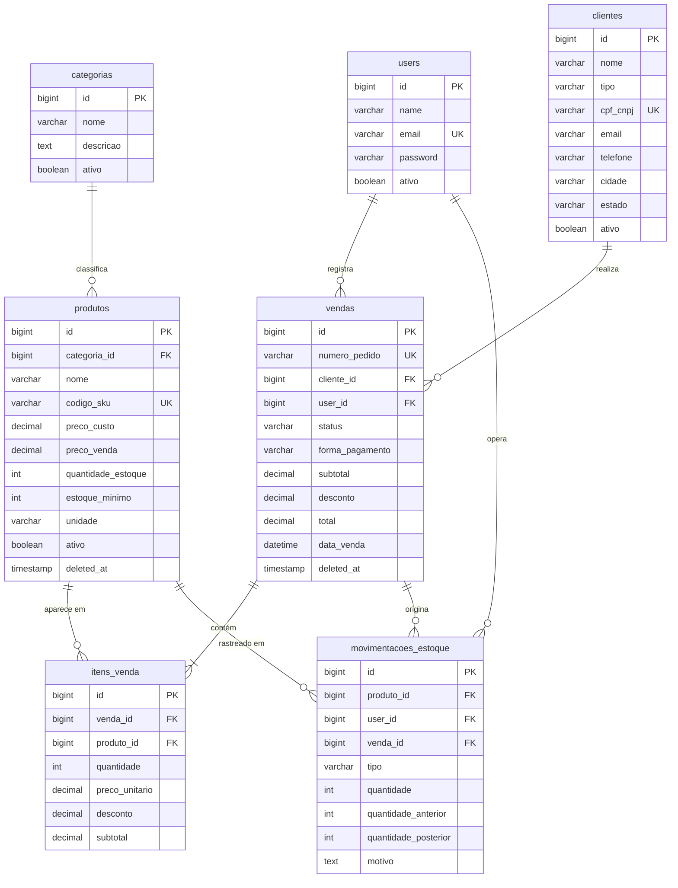

# CINDEC/MG — Sistema de Gestão Operacional em Defesa Civil

Plataforma SaaS de gestão operacional desenvolvida para o **Centro de Inteligência em Defesa Civil de Minas Gerais (CINDEC/MG)**, construída com **PHP 8.4 + Laravel 12**, **Vue.js 3 + Inertia.js** e **Tailwind CSS v4**, seguindo as melhores práticas do mercado: Clean Code, SOLID, Service Layer e testes automatizados.

O sistema centraliza o controle de **ativos tecnológicos**, **ordens de fornecimento**, **entidades parceiras** e operações de campo da Defesa Civil mineira.

---

## Stack Tecnológica

| Camada | Tecnologia |
|---|---|
| Backend | PHP 8.4 + Laravel 12 |
| Frontend | Vue.js 3 + Inertia.js 2 |
| Estilização | Tailwind CSS v4 |
| Banco de Dados | MySQL 8.0 |
| Infraestrutura | Docker + Laravel Sail (docker-compose customizado) |
| ACL | Spatie Laravel Permission v6 |
| Testes | PHPUnit 11 |

---

## Funcionalidades

### Autenticação Completa
- Cadastro de novo usuário (com confirmação de senha)
- Login com "lembrar de mim"
- Esqueci a senha (envio de link por e-mail)
- Redefinição de senha via token
- Logout seguro
- Bloqueio de login para contas desativadas

### Módulos da Aplicação
- **Ativos Tecnológicos (Estoque)**: CRUD completo de equipamentos e ativos com movimentações de entrada/saída/ajuste/estorno
- **Ordens de Fornecimento (Vendas)**: Registro de ordens com múltiplos itens, integridade de inventário via transação atômica
- **Entidades (Clientes)**: Cadastro de órgãos públicos, parceiros e entidades de defesa civil
- **Categorias**: Organização e classificação de ativos tecnológicos
- **Usuários** (admin): Gestão de operadores do sistema e atribuição de papéis

### Painel Administrativo
- Indicadores em tempo real: valores operacionais, total de ordens, ativos em inventário, total de entidades
- Ordens recentes de fornecimento
- Ativos em destaque por volume operacional
- Gráficos de volume operacional semanal e eficiência de fornecimento

### Gestão de Acesso (ACL)
| Papel | Acesso |
|---|---|
| `admin` | Acesso total, incluindo gestão de usuários |
| `editor` | Pode criar e editar estoque, vendas e clientes |
| `usuario` | Somente visualização |

---

## Arquitetura

```
src/
├── app/
│   ├── Http/
│   │   ├── Controllers/       # Controllers RESTful (index/store/show/update/destroy)
│   │   │   └── Auth/          # Login, Cadastro, EsqueciSenha, RedefinirSenha
│   │   ├── Middleware/        # HandleInertiaRequests, VerificarRole
│   │   └── Requests/          # Form Requests com validação e mensagens PT-BR
│   ├── Models/                # Eloquent com Relationships, Casts, SoftDeletes
│   ├── Services/
│   │   ├── VendaService.php   # Lógica de negócio de vendas (DB::transaction)
│   │   └── EstoqueService.php # Lógica de movimentação de estoque
│   └── Providers/
├── database/
│   ├── migrations/            # Estrutura das tabelas com FKs
│   ├── seeders/               # Roles, Usuários, Produtos, Vendas de exemplo
│   └── factories/             # Factories para testes
├── resources/js/
│   ├── Pages/                 # Componentes de página Vue (Inertia)
│   │   ├── Auth/              # Login, Cadastro, EsqueciSenha, RedefinirSenha
│   │   ├── Dashboard/         # Painel principal
│   │   ├── Estoque/           # Index, Formulario, Visualizar
│   │   ├── Vendas/            # Index, Formulario, Visualizar
│   │   ├── Clientes/          # Index, Formulario, Visualizar
│   │   ├── Categorias/        # Index (CRUD via modal)
│   │   └── Usuarios/          # Index, Formulario, Visualizar
│   ├── Layouts/
│   │   └── AppLayout.vue      # Layout principal com sidebar responsiva
│   └── Components/            # Badge, Botao, InputField, Modal, NavItem, Paginacao, SelectField
└── tests/
    ├── Feature/               # AuthTest, EstoqueTest, VendaTest, ClienteTest, AclTest
    └── Unit/                  # VendaServiceTest, EstoqueServiceTest
```

---

## Diagrama do Banco de Dados

### ERD — Relacionamentos



### Detalhamento das Colunas
users
├── id (PK)
├── name
├── email (unique)
├── password
├── ativo (boolean)
└── timestamps

categorias
├── id (PK)
├── nome
├── descricao (nullable)
├── ativo (boolean)
└── timestamps

produtos
├── id (PK)
├── categoria_id (FK → categorias.id, nullable)
├── nome
├── codigo_sku (unique, nullable)
├── descricao (nullable)
├── preco_custo (decimal)
├── preco_venda (decimal)
├── quantidade_estoque (integer)
├── estoque_minimo (integer)
├── unidade
├── ativo (boolean)
├── timestamps
└── deleted_at (SoftDelete)

clientes
├── id (PK)
├── nome
├── tipo (pessoa_fisica | pessoa_juridica)
├── cpf_cnpj (unique, nullable)
├── email (nullable)
├── telefone (nullable)
├── logradouro, numero, bairro, cidade, estado, cep (nullable)
├── ativo (boolean)
└── timestamps

vendas
├── id (PK)
├── numero_pedido (unique)
├── cliente_id (FK → clientes.id, nullable)
├── user_id (FK → users.id, nullable)
├── status (pendente | processando | concluido | cancelado)
├── forma_pagamento (dinheiro | cartao_credito | cartao_debito | pix)
├── subtotal, desconto, total (decimal)
├── observacoes (nullable)
├── data_venda (datetime)
├── timestamps
└── deleted_at (SoftDelete)

itens_venda
├── id (PK)
├── venda_id (FK → vendas.id)
├── produto_id (FK → produtos.id, nullable)
├── quantidade (integer)
├── preco_unitario (decimal)
├── desconto (decimal)
├── subtotal (decimal)
└── timestamps

movimentacoes_estoque
├── id (PK)
├── produto_id (FK → produtos.id)
├── user_id (FK → users.id, nullable)
├── venda_id (FK → vendas.id, nullable)
├── tipo (entrada | saida | ajuste | estorno)
├── quantidade (integer)
├── quantidade_anterior, quantidade_posterior (integer)
├── motivo (nullable)
└── timestamps

-- Tabelas do Spatie (ACL) --
roles, permissions, model_has_roles, model_has_permissions, role_has_permissions
```

---

## Como Executar (Docker)

### Pré-requisitos
- Docker e Docker Compose instalados
- `just` instalado ([instalar](https://github.com/casey/just)) — opcional, mas recomendado

### Subir o ambiente

> **Nota sobre Laravel Sail:** O projeto inclui `laravel/sail` como dependência de desenvolvimento (`require-dev`), porém utiliza um **docker-compose customizado** com containers dedicados (PHP-FPM 8.4, Nginx, MySQL 8.0 e Node) para maior controle sobre a configuração de cada serviço. Os comandos abaixo operam diretamente via `docker-compose` ou pelo atalho `just`, sem necessidade de `./vendor/bin/sail`.

```bash
# 1. Clone o repositório
git clone <url-do-repositorio>
cd DesafioDC

# 2. Copie o arquivo de variáveis de ambiente
cp src/.env.example src/.env

# 3. Suba os containers
just build
# ou diretamente:
docker-compose up -d --build
```

### Configurar a aplicação (dentro do container)

```bash
# Abrir shell no container da aplicação
just shell app
# ou:
docker-compose exec app sh

# Dentro do container:
composer install
php artisan key:generate
php artisan migrate --force
php artisan db:seed
npm install && npm run build
```

### Acessar

| Serviço | URL |
|---|---|
| Aplicação | http://localhost:8081 |
| Vite (dev) | http://localhost:5173 |
| MySQL | localhost:3306 |

### Credenciais de acesso (após seed)

| E-mail | Senha | Papel |
|---|---|---|
| admin@cindec.mg.gov.br | password | admin |
| editor@cindec.mg.gov.br | password | editor |
| operador@cindec.mg.gov.br | password | usuario |

---

## Comandos Justfile

```bash
just list          # Lista todos os comandos disponíveis
just build         # Build das imagens + sobe os containers
just up            # Sobe os containers sem rebuild
just shell app     # Abre terminal no container PHP
just rebuild       # Derruba volumes, reconstrói do zero
just migrate       # Executa migrations dentro do container
just seed          # Executa seeders dentro do container
just test          # Executa suite de testes PHPUnit
```

---

## Executar os Testes

```bash
# Dentro do container:
php artisan test

# Com cobertura por suite:
php artisan test --testsuite=Feature
php artisan test --testsuite=Unit

# Teste específico:
php artisan test --filter=AclTest
php artisan test --filter=VendaServiceTest
```

### Suítes de Testes

| Arquivo | Testes | Cobertura |
|---|---|---|
| `Feature/AuthTest` | 6 | Login, cadastro, logout, redirecionamentos |
| `Feature/EstoqueTest` | 6 | CRUD produtos, movimentações, validações |
| `Feature/VendaTest` | 7 | Criação, cálculo, cancelamento, estorno |
| `Feature/ClienteTest` | 5+ | CRUD clientes, filtros, validações |
| `Feature/AclTest` | 14 | Papéis, permissões granulares, usuário inativo |
| `Unit/VendaServiceTest` | 9 | Service de vendas isolado do HTTP |
| `Unit/EstoqueServiceTest` | 7 | Service de estoque isolado do HTTP |

---

## Decisões Técnicas

### Service Layer
`VendaService` e `EstoqueService` encapsulam toda a lógica de negócio:
- `VendaService::criar()` — cria a venda, decrementa estoque e registra movimentação, tudo em uma única `DB::transaction()`
- `VendaService::atualizarStatus()` — ao cancelar, devolve o estoque via movimentação de estorno
- `EstoqueService::atualizar()` — detecta variação de estoque e registra ajuste automático

### Integridade de Dados
- Todas as operações que envolvem múltiplas tabelas usam `DB::transaction()`
- `SoftDeletes` em `Produto` e `Venda` preserva histórico
- `nullOnDelete` nas FK de `produto_id` em `itens_venda` evita erros ao remover produto

### ACL com Spatie
- Permissões granulares: `ver-`, `criar-`, `editar-`, `excluir-` por módulo
- Middleware `VerificarRole` nas rotas administrativas
- Frontend reage ao papel do usuário (`$page.props.auth.user.roles`)

### Frontend
- Inertia.js como ponte entre Laravel e Vue (sem API REST separada)
- Ziggy para geração de rotas no frontend (`route('nome.rota')`)
- Componentes reutilizáveis: `Badge`, `Botao`, `InputField`, `Modal`, `NavItem`, `Paginacao`, `SelectField`
- Layout responsivo com sidebar colapsável no mobile

---

## Modelo de Negócio

O CINDEC/MG é uma plataforma SaaS de gestão operacional para o Centro de Inteligência em Defesa Civil de Minas Gerais, com os seguintes fluxos principais:

1. **Acesso Seguro** → Operador acessa o Portal Operacional com credenciais institucionais e papel definido
2. **Gestão de Ativos** → Admin/Editor cadastra equipamentos e ativos tecnológicos com custo de aquisição, valor de referência, categoria e quantidade mínima operacional
3. **Ordem de Fornecimento** → Responsável vincula entidade + ativos → sistema decrementa inventário automaticamente
4. **Monitoramento** → Dashboard exibe métricas operacionais em tempo real (24/7)
5. **Cancelamento de Ordem** → Ao cancelar, inventário é devolvido via movimentação de estorno
6. **ACL** → Admin controla operadores do sistema e seus níveis de acesso institucional

---

Desenvolvido por **Barbara Costa** · CINDEC/MG — Centro de Inteligência em Defesa Civil de Minas Gerais
