# DabangSaaS — Desafio Técnico Full Stack

> Plataforma SaaS de gestão comercial com painel analítico, controle de estoque, CRM, ACL por papéis e suporte a múltiplos idiomas.

---

## Índice

- [Tecnologias](#tecnologias)
- [Início Rápido](#início-rápido)
- [Acessos de Demonstração](#acessos-de-demonstração)
- [Módulos e Funcionalidades](#módulos-e-funcionalidades)
- [ACL — Papéis e Permissões](#acl--papéis-e-permissões)
- [Diagrama ER](#diagrama-er)
- [Arquitetura de Backend](#arquitetura-de-backend)
- [Design & Referência Figma](#design--referência-figma)
- [Testes Automatizados](#testes-automatizados)
- [Estrutura do Projeto](#estrutura-do-projeto)
- [Comandos Úteis](#comandos-úteis)

---

## Tecnologias

| Camada | Stack |
|---|---|
| Backend | PHP 8.4 · Laravel 12 · Inertia.js (server-side adapter) |
| Frontend | Vue 3 (Composition API) · Inertia.js · Tailwind CSS v4 |
| Banco de Dados | MySQL 8.0 |
| Autenticação | Laravel Auth nativo (session-based) |
| ACL | Spatie Laravel Permission (roles + policies) |
| Gráficos | ApexCharts via vue3-apexcharts |
| Internacionalização | i18n customizado (composable reativo, PT/EN) |
| Fila | Laravel Queue (database driver) — e-mails assíncronos |
| Infra | Docker · Nginx · PHP-FPM · Vite 6 (HMR) · Node 20 |

---

## Início Rápido

### Pré-requisitos

- Docker Desktop instalado e em execução
- Portas `8081` (HTTP) e `3306` (MySQL) livres

### Subindo o ambiente

```bash
docker compose up -d --build
```

O primeiro boot executa automaticamente via `entrypoint.sh`:

1. `composer install`
2. `php artisan key:generate`
3. `php artisan migrate --force`
4. `php artisan db:seed --force`
5. `php artisan storage:link`

Aplicação disponível em **http://localhost:8081**

---

## Acessos de Demonstração

> Criados automaticamente pelo `DemoDataSeeder` ao subir o ambiente.

| Perfil | E-mail | Senha | Permissões |
|---|---|---|---|
| 👑 Admin | `admin@dabang.app` | `password` | Acesso total — todos os módulos, gestão de usuários |
| ✏️ Editor | `editor@dabang.app` | `password` | Dashboard, Produtos (criar/editar), Vendas, Clientes |
| 👤 User | `user@dabang.app` | `password` | Dashboard, visualizar Produtos/Vendas/Clientes, criar Vendas |

> **URL de acesso:** http://localhost:8081/login

---

### Build dos assets

```bash
# Desenvolvimento (HMR via container node)
docker compose exec node npm run dev

# Produção (build otimizado com code splitting)
docker compose exec node npm run build
```

---

## Módulos e Funcionalidades

### 🔐 Autenticação

| Recurso | Descrição |
|---|---|
| Login | Tela dark-tech com animações (blobs + partículas CSS) e glassmorphism |
| Registro | Cadastro de novo usuário com confirmação de senha |
| Esqueci a senha | Envio de link por e-mail via fila assíncrona |
| Redefinir senha | Token com expiração, campos de nova senha |
| Logout | Invalidação de sessão + redirect |
| Layout consistente | Todas as telas de auth seguem o mesmo tema escuro |

### 📊 Dashboard

| Recurso | Descrição |
|---|---|
| Cards de KPIs | Receita total, total de vendas, produtos ativos, clientes cadastrados |
| Gráfico de receita | Barras com evolução mensal dos últimos 6 meses |
| Gráfico de desempenho | Linha com comparativo de dois períodos |
| Gráfico de meta | Realizado vs. Meta com indicador percentual |
| Gráfico de satisfação | Comparativo mês atual × mês anterior |
| Tabela de vendas recentes | ID, cliente, vendedor, total, status, data — com badge colorido |
| Top países / origem | Ranking de receita por país com barras de progresso |
| Alerta de estoque crítico | Produtos abaixo do estoque mínimo em destaque |

### 📦 Produtos (Estoque)

| Recurso | Descrição |
|---|---|
| Listagem | Tabela com busca textual, filtro por categoria e por status |
| Criação / Edição | Formulário completo: nome, SKU, descrição, preço de custo, preço de venda, estoque, estoque mínimo, categoria |
| Upload de imagem | Campo de imagem com preview; armazenado via `storage/app/public` |
| Calculadora de margem | Cálculo em tempo real de margem e markup |
| Alerta de estoque mínimo | Badge vermelho quando `stock_quantity <= min_stock` |
| Ativação / Inativação | Toggle de status: `active` / `inactive` |
| Exclusão | Soft delete com verificação de permissão |

### 💰 Vendas

| Recurso | Descrição |
|---|---|
| Nova venda | Seleção de cliente, múltiplos itens com quantidade e preço unitário |
| Desconto | Aplicação de desconto em valor absoluto por venda |
| Notas | Campo de observação opcional |
| Cálculo automático | Subtotal, desconto e total calculados em tempo real |
| Status da venda | Fluxo: `Pendente → Concluída` ou `Pendente → Cancelada` |
| Reversão de estoque | Ao cancelar uma venda, o estoque dos produtos é restaurado automaticamente |
| Listagem | Busca por ID/cliente, filtro por status, paginação |
| Visualização | Página de detalhe com todos os itens, desconto e totais |

### 👥 Clientes (CRM)

| Recurso | Descrição |
|---|---|
| Cadastro completo | Nome, e-mail, telefone, CPF/CNPJ, endereço, cidade, estado |
| Listagem | Busca textual, paginação |
| Histórico | Total de compras e valor total gasto por cliente |
| Ticket médio | Calculado dinamicamente na tela de detalhe |
| Edição / Exclusão | Com verificação ACL |

### 👤 Usuários _(admin only)_

| Recurso | Descrição |
|---|---|
| Listagem | Nome, e-mail, papel (role), data de cadastro |
| Criação | Nome, e-mail, senha, papel |
| Edição | Atualização de dados + troca de papel |
| Exclusão | Apenas admin, com verificação de não-autodestruição |

### 🏆 Leaderboard

- Ranking de desempenho dos vendedores
- Métricas: volume de vendas, receita gerada, quantidade de clientes

### ⚙️ Configurações

| Aba | Funcionalidades |
|---|---|
| Perfil | Nome, sobrenome, e-mail, telefone, bio — botão de salvar com feedback |
| Segurança | Alteração de senha (atual + nova + confirmação), ativação de 2FA |
| Notificações | 6 preferências de notificação configuráveis (email + push) |
| Aparência | Seleção de tema (Claro / Escuro / Sistema) e cor de destaque |

### 🌐 Internacionalização (i18n)

- Seletor de idioma no header (PT 🇧🇷 / EN 🇺🇸) com bandeiras
- Tradução reativa de **todo o sistema** ao trocar o idioma (sem reload)
- Composable `useI18n` baseado em singleton Vue reativo + `localStorage`
- Locale padrão: **Português**
- Cobertura: Dashboard, Produtos, Vendas, Clientes, Usuários, Configurações, mensagens de status

### 🔔 Notificações

- Sino de notificações no header com badge de contagem
- Painel lateral (slide-over) com abas: Todas / Não lidas
- Integração visual com o tema escuro do sistema

---

## ACL — Papéis e Permissões

> Implementado com **Spatie Laravel Permission** + **Laravel Policies** por recurso.

| Permissão | Admin | Editor | User |
|---|:---:|:---:|:---:|
| Acessar dashboard | ✅ | ✅ | ✅ |
| Ver produtos | ✅ | ✅ | ✅ |
| Criar / Editar produtos | ✅ | ✅ | ❌ |
| Excluir produtos | ✅ | ❌ | ❌ |
| Ver vendas | ✅ | ✅ | ✅ |
| Criar vendas | ✅ | ✅ | ✅ |
| Alterar status de vendas | ✅ | ✅ | ❌ |
| Ver clientes | ✅ | ✅ | ✅ |
| Criar / Editar clientes | ✅ | ✅ | ❌ |
| Excluir clientes | ✅ | ❌ | ❌ |
| Gerenciar usuários | ✅ | ❌ | ❌ |
| Ver leaderboard | ✅ | ✅ | ✅ |
| Configurações | ✅ | ✅ | ✅ |

---

## Diagrama ER

```mermaid
flowchart LR

    %% ══════════════════════════════════════════
    %%  DOMÍNIO: AUTH
    %% ══════════════════════════════════════════
    subgraph DA["  👤  AUTH"]
        direction TB
        USERS["**USERS**
        ─────────────────
        🔑 id · bigint · PK
        name · string
        email · string · UK
        password · string
        avatar · string
        created_at · timestamp"]
    end

    %% ══════════════════════════════════════════
    %%  DOMÍNIO: CATÁLOGO
    %% ══════════════════════════════════════════
    subgraph DC["  🏷️  CATÁLOGO"]
        direction TB
        CATEGORIES["**CATEGORIES**
        ─────────────────
        🔑 id · bigint · PK
        name · string
        slug · string · UK
        created_at · timestamp"]

        PRODUCTS["**PRODUCTS**
        ─────────────────
        🔑 id · bigint · PK
        🔗 category_id · FK
        name · string
        sku · string · UK
        description · text
        purchase_price · decimal
        sale_price · decimal
        stock_quantity · int
        min_stock · int
        image_path · string
        status · active|inactive
        created_at · timestamp"]
    end

    %% ══════════════════════════════════════════
    %%  DOMÍNIO: COMERCIAL
    %% ══════════════════════════════════════════
    subgraph DB2["  💰  COMERCIAL"]
        direction TB
        CUSTOMERS["**CUSTOMERS**
        ─────────────────
        🔑 id · bigint · PK
        name · string
        email · string · UK
        phone · string
        document · CPF/CNPJ
        address · string
        city · string
        state · char(2)
        created_at · timestamp"]

        SALES["**SALES**
        ─────────────────
        🔑 id · bigint · PK
        🔗 user_id · FK
        🔗 customer_id · FK
        status · pending|completed|cancelled
        subtotal · decimal
        discount · decimal
        total · decimal
        notes · text
        created_at · timestamp"]

        SALE_ITEMS["**SALE_ITEMS**
        ─────────────────
        🔑 id · bigint · PK
        🔗 sale_id · FK
        🔗 product_id · FK
        quantity · int
        unit_price · decimal
        total_price · decimal"]
    end

    %% ══════════════════════════════════════════
    %%  DOMÍNIO: ACL
    %% ══════════════════════════════════════════
    subgraph DACL["  🔐  ACL  —  Spatie Permission"]
        direction TB
        ROLES["**ROLES**
        ─────────────────
        🔑 id · bigint · PK
        name · admin|editor|user
        guard_name · string"]

        PERMISSIONS["**PERMISSIONS**
        ─────────────────
        🔑 id · bigint · PK
        name · string
        guard_name · string"]

        MODEL_HAS_ROLES["**MODEL_HAS_ROLES**
        ─────────────────
        🔗 role_id · FK
        model_type · string
        🔗 model_id · FK"]

        ROLE_HAS_PERMS["**ROLE_HAS_PERMISSIONS**
        ─────────────────
        🔗 permission_id · FK
        🔗 role_id · FK"]
    end

    %% ══════════════════════════════════════════
    %%  RELACIONAMENTOS
    %% ══════════════════════════════════════════
    CATEGORIES      -->|"1 : N  classifica"| PRODUCTS
    USERS           -->|"1 : N  registra"| SALES
    CUSTOMERS       -->|"1 : N  realiza"| SALES
    SALES           -->|"1 : N  contém"| SALE_ITEMS
    PRODUCTS        -->|"1 : N  referenciado em"| SALE_ITEMS
    USERS           -->|"N : N  via pivot"| MODEL_HAS_ROLES
    ROLES           -->|"atribuído a"| MODEL_HAS_ROLES
    ROLES           -->|"N : N  via pivot"| ROLE_HAS_PERMS
    PERMISSIONS     -->|"concedido a"| ROLE_HAS_PERMS

    %% ══════════════════════════════════════════
    %%  ESTILOS POR DOMÍNIO
    %% ══════════════════════════════════════════
    style DA        fill:#1e1b4b,color:#c4b5fd,stroke:#4338ca,stroke-width:2px
    style USERS     fill:#312e81,color:#e0e7ff,stroke:#6366f1,stroke-width:1px

    style DC        fill:#14532d,color:#bbf7d0,stroke:#16a34a,stroke-width:2px
    style CATEGORIES fill:#166534,color:#dcfce7,stroke:#22c55e,stroke-width:1px
    style PRODUCTS  fill:#166534,color:#dcfce7,stroke:#22c55e,stroke-width:1px

    style DB2       fill:#7c2d12,color:#fed7aa,stroke:#ea580c,stroke-width:2px
    style CUSTOMERS fill:#9a3412,color:#ffedd5,stroke:#f97316,stroke-width:1px
    style SALES     fill:#9a3412,color:#ffedd5,stroke:#f97316,stroke-width:1px
    style SALE_ITEMS fill:#9a3412,color:#ffedd5,stroke:#f97316,stroke-width:1px

    style DACL      fill:#4a1d96,color:#ede9fe,stroke:#7c3aed,stroke-width:2px
    style ROLES     fill:#5b21b6,color:#f3e8ff,stroke:#9333ea,stroke-width:1px
    style PERMISSIONS fill:#5b21b6,color:#f3e8ff,stroke:#9333ea,stroke-width:1px
    style MODEL_HAS_ROLES fill:#3b0764,color:#e9d5ff,stroke:#a855f7,stroke-width:1px
    style ROLE_HAS_PERMS  fill:#3b0764,color:#e9d5ff,stroke:#a855f7,stroke-width:1px
```



---

## Arquitetura de Backend

```mermaid
flowchart TD
    BROWSER(["🌐  Browser  ·  Vue 3  +  Inertia.js"])

    %% ─── LAYER 1 — INFRA ────────────────────────────────────────────
    subgraph L1["  1 · INFRAESTRUTURA"]
        direction LR
        NG["🔀 Nginx\nReverse Proxy  :8081"]
        FPM["🐘 PHP-FPM 8.4\nLaravel 12"]
        NG --> FPM
    end

    %% ─── LAYER 2 — MIDDLEWARE ───────────────────────────────────────
    subgraph L2["  2 · MIDDLEWARE  PIPELINE"]
        direction LR
        MW1["EncryptCookies"]
        MW2["StartSession"]
        MW3["VerifyCsrfToken"]
        MW4["HandleInertiaRequests\nauth · flash · locale"]
        MW1 --> MW2 --> MW3 --> MW4
    end

    %% ─── LAYER 3 — ROUTES ───────────────────────────────────────────
    subgraph L3["  3 · ROTEADOR"]
        direction LR
        RG["👤 guest\n/login  ·  /register\n/forgot-password  ·  /reset-password"]
        RA["🔒 auth\n/  ·  /products  ·  /sales\n/customers  ·  /settings  ·  /leaderboard"]
        RD["👑 auth + role:admin\n/users"]
    end

    %% ─── LAYER 4 — CONTROLLERS ──────────────────────────────────────
    subgraph L4["  4 · CONTROLLERS  (thin)"]
        direction LR
        C1["Auth\nController"]
        C2["Dashboard\nController"]
        C3["Product\nController"]
        C4["Sale\nController"]
        C5["Customer\nController"]
        C6["User\nController"]
    end

    %% ─── LAYER 5 — VALIDATION + POLICIES ───────────────────────────
    subgraph L5["  5 · VALIDAÇÃO  &  AUTORIZAÇÃO"]
        direction LR
        subgraph FR["  Form Requests  ✅"]
            direction TB
            FR1["ProductRequest"]
            FR2["SaleRequest"]
            FR3["CustomerRequest"]
            FR4["UserRequest"]
        end
        subgraph PL["  Policies  🔐"]
            direction TB
            P1["ProductPolicy"]
            P2["SalePolicy"]
            P3["CustomerPolicy"]
            P4["UserPolicy"]
        end
    end

    %% ─── LAYER 6 — SERVICES ─────────────────────────────────────────
    subgraph L6["  6 · SERVICES  —  Lógica de Negócio"]
        direction LR
        S1["⚙️ ProductService\ncalcMargin()  ·  checkLowStock()"]
        S2["⚙️ SaleService\ncreateWithItems()  ·  decrementStock()\nrestoreStockOnCancel()"]
    end

    %% ─── LAYER 7 — MODELS ───────────────────────────────────────────
    subgraph L7["  7 · ELOQUENT  MODELS"]
        direction LR
        M1["👤 User"]
        M2["📦 Product"]
        M3["💰 Sale"]
        M4["🧾 SaleItem"]
        M5["🧑 Customer"]
        M6["🏷️ Category"]
    end

    %% ─── LAYER 8 — PERSISTENCE ──────────────────────────────────────
    subgraph L8["  8 · PERSISTÊNCIA"]
        direction LR
        DB[("🗄️ MySQL 8.0\nusers · products · categories\nsales · sale_items · customers\nroles · permissions · cache")]
        QU["📬 Queue Worker\nQueuedResetPassword\n↓\n📧 SMTP / Mailpit"]
    end

    %% ─── CONNECTIONS ────────────────────────────────────────────────
    BROWSER      -->|"HTTP Request"| L1
    L1           --> L2
    L2           --> L3
    L3           --> L4
    L4           --> L5
    L5           --> L6
    L6           --> L7
    L7           --> DB
    C1           -.->|"email assíncrono"| QU
    DB           -->|"Inertia::render( data )"| BROWSER

    %% ─── STYLES ─────────────────────────────────────────────────────
    style BROWSER fill:#7c3aed,color:#fff,stroke:#5b21b6,stroke-width:2px
    style L1      fill:#0f172a,color:#94a3b8,stroke:#334155,stroke-width:2px
    style L2      fill:#1e293b,color:#cbd5e1,stroke:#475569,stroke-width:2px
    style L3      fill:#172554,color:#93c5fd,stroke:#1d4ed8,stroke-width:2px
    style L4      fill:#1e1b4b,color:#c4b5fd,stroke:#4338ca,stroke-width:2px
    style L5      fill:#1a0533,color:#e9d5ff,stroke:#7c3aed,stroke-width:2px
    style FR      fill:#2e1065,color:#ddd6fe,stroke:#6d28d9,stroke-width:1px
    style PL      fill:#3b0764,color:#f3e8ff,stroke:#9333ea,stroke-width:1px
    style L6      fill:#431407,color:#fed7aa,stroke:#c2410c,stroke-width:2px
    style L7      fill:#14532d,color:#bbf7d0,stroke:#16a34a,stroke-width:2px
    style L8      fill:#1e3a8a,color:#bfdbfe,stroke:#2563eb,stroke-width:2px
    style DB      fill:#1e3a8a,color:#bfdbfe,stroke:#3b82f6
    style QU      fill:#064e3b,color:#a7f3d0,stroke:#059669
```



---

## Design & Referência Figma

> O layout do sistema foi desenvolvido com base no template **Sales Dashboard Design (Community)** disponível no Figma, adaptado para o contexto SaaS da plataforma Dabang.

**🔗 Referência Figma:**  
[Sales Dashboard Design — Community (node 804-24216)](https://www.figma.com/design/VrDfKvA1aFSRiWlUyTUthV/Sales-Dashboard-Design--Community-?node-id=804-24216&p=f&t=dvvO2lTbFBTJT3om-0)

### Decisões de Design

| Aspecto | Decisão | Justificativa |
|---|---|---|
| Paleta de cores | Fundo `#160e35` + accent `#7C3AED` (violet-600) | Inspirado no dark mode do Figma de referência — transmite sofisticação SaaS |
| Tipografia | Sistema padrão Tailwind (Inter / sans-serif) | Legível, moderna e compatível com todas as resoluções |
| Cards e glassmorphism | `bg-white/[0.07] backdrop-blur-xl` | Padrão visual do Figma aplicado às telas de autenticação |
| Sidebar | Fixa, responsiva, com ícones + labels | Navegação persistente igual ao modelo de referência |
| Dashboard KPIs | Cards numéricos com trend indicator (↑/↓) | Diretamente baseado nos cards do Figma |
| Gráficos | ApexCharts (barras, linhas, área) | Corresponde aos gráficos de receita e desempenho do Figma |
| Tabelas | Striped rows, badges de status coloridos | Padrão de listagem do Figma |
| Telas de Auth | Dark tech com blobs + partículas + glassmorphism | Reinterpretação moderna e coerente ao tema escuro do sistema |

### Paleta Visual

```
  Primário    #7C3AED  violet-600   ████████
  Fundo       #160e35               ████████
  Superfície  white/7%  blur        ████████
  Texto       white/90%             ████████
  Borda       white/10%             ████████
  Sucesso     #22c55e  green-500    ████████
  Alerta      #f97316  orange-500   ████████
  Erro        #ef4444  red-500      ████████
```

---

## Testes Automatizados

| Suite | Classe | Cenários Cobertos |
|---|---|---|
| Autenticação | `AuthTest` | Login válido/inválido, registro, logout, redirect de guest/autenticado, reset de senha |
| Vendas | `SaleTest` | Criação com itens, decremento de estoque, reversão ao cancelar, bloqueio de status por role |
| ACL | `AclTest` | Acesso a todos os módulos para admin / editor / user — 403 onde esperado |
| Produtos | `ProductTest` | CRUD completo, validação de SKU único, verificação de permissão por role |

```bash
# Todos os testes
php artisan test

# Apenas Feature tests
php artisan test --testsuite=Feature

# Suite específica
php artisan test --filter AuthTest
php artisan test --filter SaleTest
php artisan test --filter AclTest
php artisan test --filter ProductTest
```

---

## Estrutura do Projeto

```
DesafioDC/
├── docker/
│   ├── mysql/init/          # Scripts SQL de inicialização
│   ├── nginx/default.conf   # Configuração do Nginx
│   ├── php/
│   │   ├── Dockerfile       # PHP 8.4 FPM + extensões
│   │   ├── entrypoint.sh    # Bootstrap automático (migrate, seed, etc.)
│   │   └── php.ini
│   └── node/Dockerfile      # Node 20 + Vite HMR
├── src/
│   ├── app/
│   │   ├── Http/
│   │   │   ├── Controllers/ # Thin controllers (delegam para Services)
│   │   │   ├── Middleware/  # HandleInertiaRequests (props globais)
│   │   │   └── Requests/    # Form Requests (validação + autorização)
│   │   ├── Models/          # Eloquent + relacionamentos + casts
│   │   ├── Notifications/   # QueuedResetPassword (ShouldQueue)
│   │   ├── Policies/        # ProductPolicy · SalePolicy · CustomerPolicy · UserPolicy
│   │   ├── Providers/       # AppServiceProvider (boot de Policies)
│   │   └── Services/        # SaleService · ProductService (lógica de negócio)
│   ├── database/
│   │   ├── factories/       # ProductFactory · UserFactory (Faker)
│   │   ├── migrations/      # 10 migrations organizadas cronologicamente
│   │   └── seeders/         # DemoDataSeeder (roles, users, produtos, clientes, vendas)
│   ├── resources/
│   │   └── js/
│   │       ├── composables/
│   │       │   └── useI18n.js     # i18n reativo singleton (PT/EN)
│   │       └── Pages/
│   │           ├── Auth/          # Login · Register · ForgotPassword · ResetPassword
│   │           ├── Dashboard/     # Index (KPIs, gráficos, tabelas)
│   │           ├── Products/      # Index · Create · Edit · Show
│   │           ├── Sales/         # Index · Create · Show
│   │           ├── Customers/     # Index · Create · Edit · Show
│   │           ├── Users/         # Index · Create · Edit
│   │           ├── Leaderboard/   # Index (ranking de vendedores)
│   │           ├── Settings/      # Index (abas: Perfil, Segurança, Notificações, Aparência)
│   │           └── Layouts/
│   │               ├── AppLayout.vue   # Layout autenticado (sidebar, header, notificações, i18n)
│   │               └── GuestLayout.vue # Layout legado (não usado nas telas de auth)
│   ├── routes/web.php        # Rotas organizadas: guest / auth / admin
│   └── tests/
│       ├── Feature/          # AuthTest · SaleTest · AclTest · ProductTest
│       └── Unit/
└── docker-compose.yml
```

---

## Comandos Úteis

```bash
# Acessar container PHP
docker compose exec app sh

# Limpar todos os caches
docker compose exec app php artisan optimize:clear

# Rodar migrations + seeds
docker compose exec app php artisan migrate:fresh --seed

# Iniciar worker de filas (e-mails)
docker compose exec app php artisan queue:work --timeout=30

# Logs em tempo real
docker compose logs -f app

# Build frontend (produção)
docker compose exec node npm run build
```

---

## Design & Segurança

**Tema Visual:**  
Fundo escuro `#160e35`, accent `#7C3AED` (violet-600), glassmorphism nos cards de auth, animações CSS puras (`@keyframes blob`, `floatUp`) sem dependências externas. Design inspirado no [Figma de referência do desafio](https://www.figma.com/design/VrDfKvA1aFSRiWlUyTUthV/Sales-Dashboard-Design--Community-?node-id=804-24216&p=f&t=dvvO2lTbFBTJT3om-0).

**SOLID no Backend:**
- **S** — cada Service/Controller tem uma única responsabilidade
- **O** — Policies extensíveis sem alterar código existente
- **L** — Notifications, Services e Policies são substituíveis por contratos
- **I** — Form Requests segregam regras de validação por contexto
- **D** — Controllers dependem de abstrações (Services) e não de implementações concretas

**Reset de Senha Assíncrono:**  
`App\Notifications\QueuedResetPassword` implementa `ShouldQueue` — a requisição HTTP retorna imediatamente e o e-mail é processado pelo worker em segundo plano via `database` driver.

**Code Splitting:**  
`vite.config.js` configura `manualChunks` separando `vue-vendor`, `inertia-vendor`, `icons-vendor` e `charts-vendor` — ApexCharts (~575 kB) só é carregado na rota do Dashboard.

---

*Desenvolvido por Barbara Costa*
